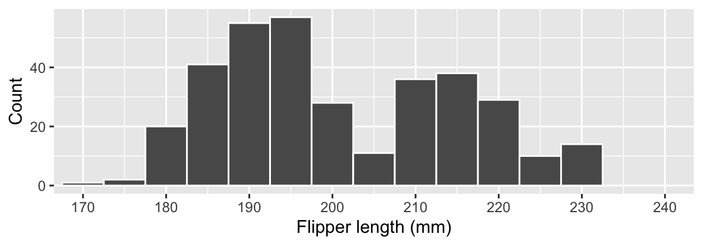
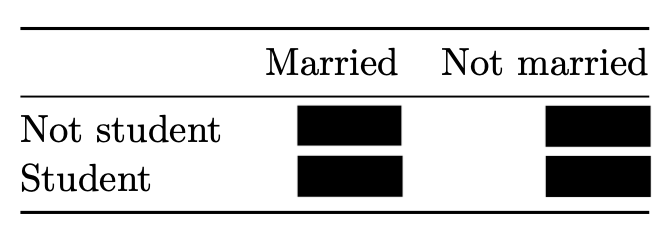

# Exam 1 - Take home


**Any potential violation of Duke’s policy on academic integrity will be
reported to the Office of Student Conduct & Community Standards. All
work on this exam must be your own.**

1.  You have until 8 am on Monday, February 19 to complete the take home
    portion of your exam. Submit your work by pushing your answers to
    your GitHub repo as well as uploading your PDF to Gradescope by the
    deadline.
2.  You are allowed to use any resources you want, except for other
    humans, during the take home exam. If you use online resources for
    code snippets or inspiration, make sure to cite them, e.g., “Code
    from StackOverflow: `link to post on StackOverflow`”.
3.  You can only ask clarification questions as private questions on Ed
    Discussion during the exam. Not to each other, not to another
    friend, and not to the TAs.
4.  As usual with all course assignments, code style, indentation,
    organization, etc. matters.
5.  The take home portion of the exam is scored out of 30 points. There
    are 6 questions, each worth 5 points and graded on the same scale as
    questions on previous labs.
6.  Write clearly. Short answers are best!

Good luck!

------------------------------------------------------------------------

# Déjà vu

## Question 1

In your in-class exam you saw the following visualization of flipper
lengths (in millimeters, mm) of `penguins` from the **palmerpenguins**
package. Typically, physiological measurements like this one follow a
unimodal distribution; this bimodal distribution is atypical.
Investigate an explanatory factor for this atypical distribution using
other variables from the `penguins` dataset. Describe the conclusion of
your investigation in 1-3 sentences, supporting it with one
visualization involving another variable or variables from this dataset.

**Hint:** This is an investigative task, so your first guess might not
be right. That’s ok! Start with trying a bunch of variables and plots,
and then pick one to include in your answer.



## Question 2

You’ve worked with the Law & Order-verse, now let’s take a look at the
CSI-verse. CSI (Crime Scene Investigation) is an American procedural
forensics crime drama television franchise that has been running since
2000.

The data you’ll use for this question is in the `data` folder of your
repository, and it’s called `tv.csv`. First, load the data with
`read_csv()`, and assign it to an object called `tv`.

``` r
tv <- read_csv("data/tv.csv")
```

**a.** Each CSI franchise includes a number of series, each with the
character string `"CSI"` (in capital letters) in their title. Using this
information, create a new data frame called `csi` that only has titles
from the CSI-verse and all of the columns from `tv` for these titles.
Then, display the first 10 rows of `csi`. **Note:** The titles and
seasons included in the dataset may not be all CSI titles and titles
that have ever aired.

**b.** In a single pipeline, find the number of seasons of each CSI
title in the data frame you created in part (a), `csi`, and display them
in descending order of number of seasons.

**c.** Create a single visualization that displays the distributions of
average ratings of seasons of each CSI title in `csi`, and write a 1-3
sentence narrative comparing how the distributions across the various
CSI titles (shows). **Requirement:** Your visualization for this
question should use a different `geom` than the one you made in Question
1.

# Credit cards

The data for the second part of the take-home exam is on credit card
balances.

The dataset is in the `data` folder of your repository, and it’s called
`credit.csv`. First, load the data with `read_csv()`, and assign it to
an object called `credit`.

``` r
credit <- read_csv("data/credit.csv")
```

The variables of interest from the dataset and their descriptions are as
follows:

- `balance`: Credit card balance in \$
- `income`: Income in \$1,000
- `student_status`: Whether the individual is a student (`Student`) or
  not (`Not student`)
- `marriage_status`: Whether the individual is a married (`Married`) or
  not (`Not married`)
- `limit`: Credit limit



## Question 3

Fill in the blanks with the appropriate numbers or terms. Your responses
must be based on your exploration of the data. You must write some code
that outputs values you place into the blanks as well as visualizations
that help you determine the terms that go into them.

**Requirement:** You must actually place the appropriate values and
terms into the blanks to get credit for this question. You will not get
credit for correct values in output that has not been placed into the
blanks. Similarly, you will not get credit for correct values or terms
placed into the blanks without supporting code output and/or
visualizations.

> The `credit` dataset has \_\_\_\_\_\_ rows and \_\_\_\_\_\_ columns.
> Each row represents a credit card customer. The primary variable of
> interest in the dataset is `balance`, credit card balances in US
> Dollars. The shape of the distribution of credit card balances is
> \_\_\_\_\_\_ and \_\_\_\_\_\_. The typical credit card balance is
> \_\_\_\_\_\_. 50% of the customers in the dataset have credit card
> balances between \_\_\_\_\_\_ and \_\_\_\_\_\_.

## Question 4

Create a scatterplot of credit card `balance` versus `income`, where the
color of points are determined by `student_status` and the plot is
faceted by `student_status` as well. Additionally, overlay a “line of
best fit” – with `geom_smoth(method = "lm", se = FALSE)`, that is also
colored by `student_status`. Make sure to set informative titles, axis,
and legend labels for your plot. Then, in 1-3 sentences, describe the
relationship between credit card balance and income, and comment on how,
if at all, it varies by student status.

## Question 5

Credit utilization is defined as the proportion of credit card `balance`
to credit `limit`. Calculate credit utilization for all individuals in
the `credit` data. Then, recreate the visualization from Question 4 with
one change: plot credit utilization versus `income`. All other aspects
of the visualization (other aesthetic mappings, geoms, faceting, etc.)
should stay the same. Make sure to set informative titles, axis, and
legend labels for your plot. Comment on how, if at all, the
relationships between income and credit utilization are different than
the relationships between income and credit card balance for students
and non-students.

## Question 6

**a.** In a single pipeline, calculate the mean credit card balances for
the following 4 groups of people: student and married, student and not
married, not student and married, not student and not married. Your
answer should be a tibble with 4 rows (one for each group of people) and
3 columns (`student_status`, `marriage_status`, and an appropriately
named column for mean credit card balance). Comment on which group has
the highest credit card balance.

**b.** It’s customary for summary statistics like the ones you
calculated in part (a) to be organized in the following tabular format:



**Note:** The values have been redacted from the table.

First, reshape your answer from part (a) to organize the information in
a similar manner and save the result as a new data frame called
`credit_summary`.

Then, display your result as a nicely formatted table using the a new
function, `kable()`. Sample code you can use is provided below. If
needed, you can adjust the `col.names` argument to match the column
names in your `credit_summary` data frame. See the [function
documentation](https://www.rdocumentation.org/packages/knitr/versions/1.45/topics/kable)
for more information on this function.

``` r
kable(credit_summary, digits = 0, col.names = c("", "Married", "Not married"))
```
